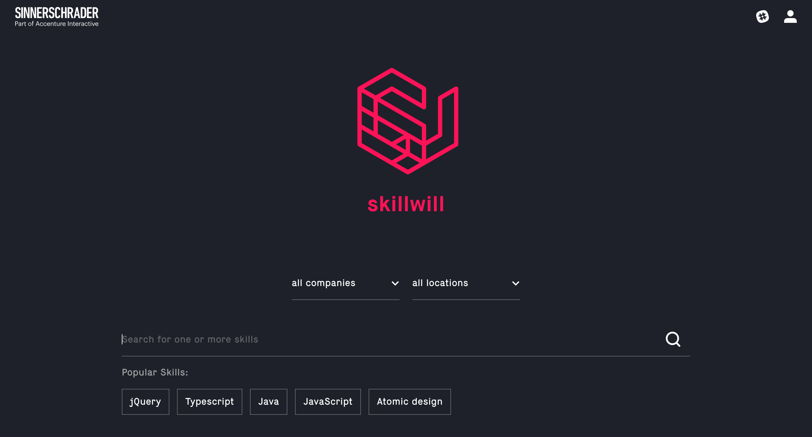
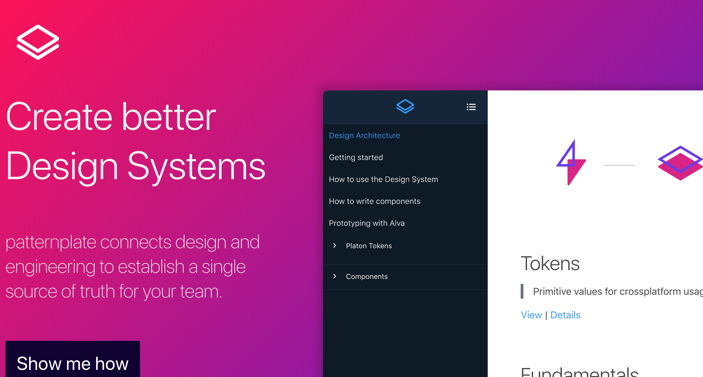

[.build-lists: true]
[.autoscale: true]

# [fit] Some project
## [fit] **on Github**
# [fit] from S2

^ @Martin

---

### SinnerSchrader Website

^ @Martin: Our widely known website

---

### Account Tool

^ @Martin: Our beloved account tool

---

### SkillWill

^ @Martin: The infamous SkillWill tool

---

### PushTheButton

^ @Martin: The game that changed the world

---

### AEM React

^ @Martin: And of course project related work that is used in our client projects.
^ @Martin: But there are more. These where just some examples.
^ @Martin: Like you all know there is also PatternPlate (next slide).

---

### PatternPlate

^ @Martin

---

### Alva

^ @Martin: Both can be found in there own organization, here (next slide)

---

_github.com/patternplate_

_github.com/meetalva_

^ @Martin

---
