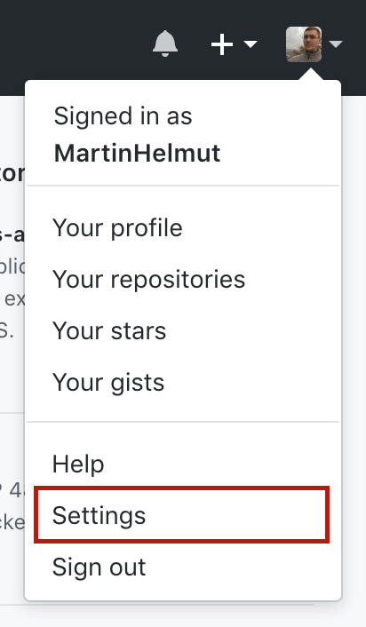
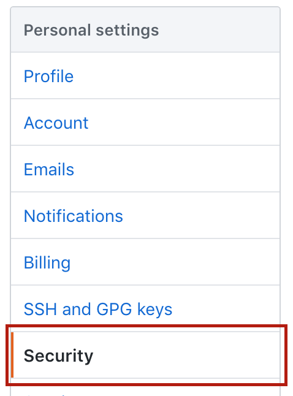
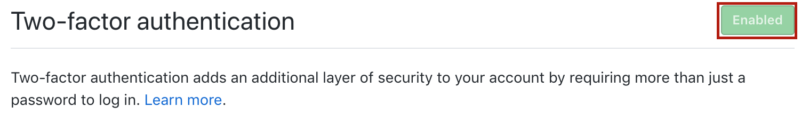
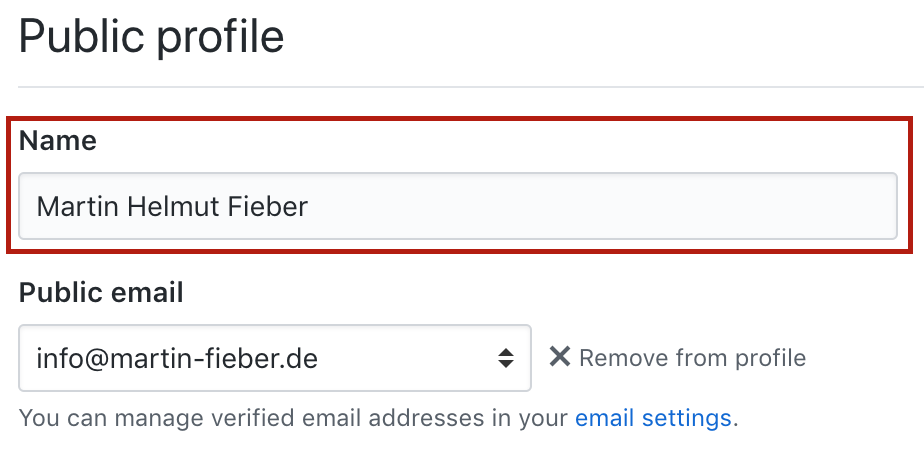
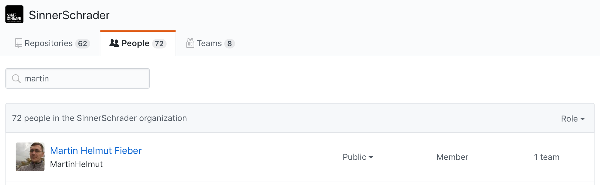
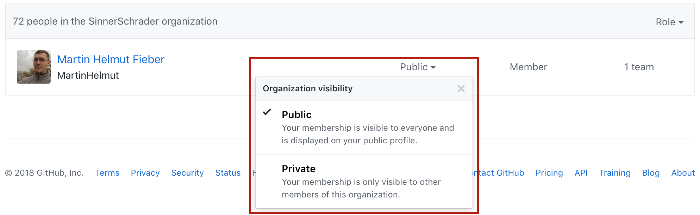

## Some **settings** to take care of

^ @Martin

---

# [fit] 2FA
**(Two-factor authentication)**

^ @Martin

---

Go to your settings ...

^ @Martin

---

Open the **security tab**

^ @Martin

---

Enable 2FA

^ @Martin

---

Follow further instructions 😎

^ @Martin: These will guide you through the process of enabling 2FA.

---

Give yourself a _public name_.

^ @Martin: But there is more.

---

It would be lovely if this would be your **real name** 😉

^ @Martin: Or your first name with one letter surname or some like that.

---

Again, open your settings ...

^ @Martin

---

And add your name so people know who you are

^ @Martin

---

Do you want others to see that you're **part of the SinnerSchrader Organization**?

^ @Martin: There is also the question if you want others to see that you're part of the SinnerSchrader Organization.

---

Because: **Default is private!**

^ @Martin

---

Go to our Organization

_github.com/sinnerschrader_

^ @Martin

---

Open the _people_ tab

^ @Martin

---

Search for your name

^ @Martin

---

And set yourself to **public**

^ @Martin

---

**Done** 🎉

^ @Martin: Now others can see that you're part of the SinnerSchrader Organization

---
