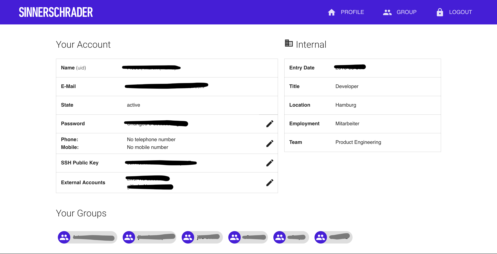
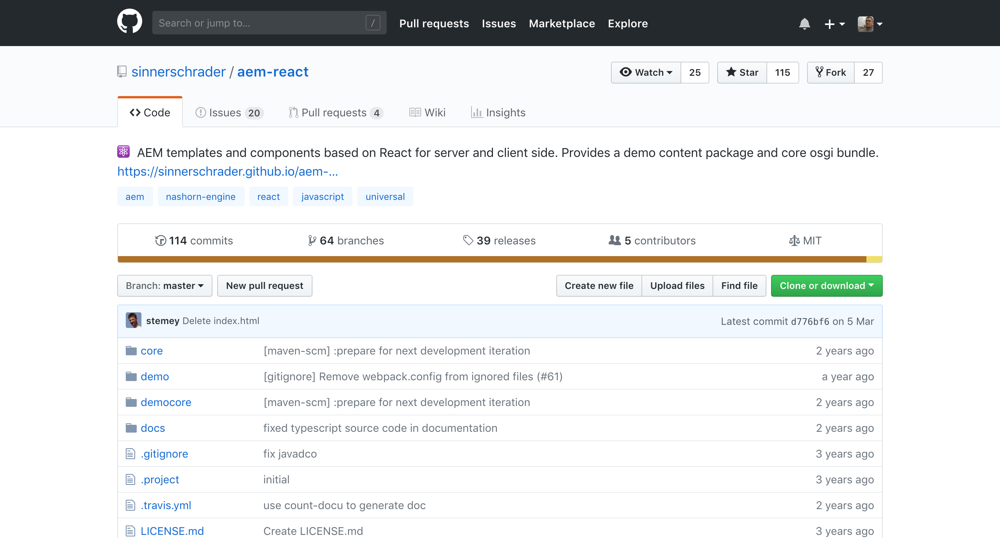
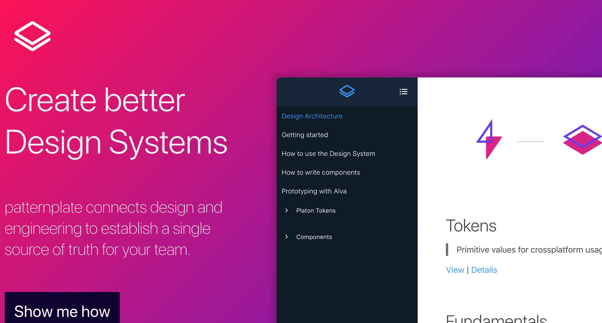
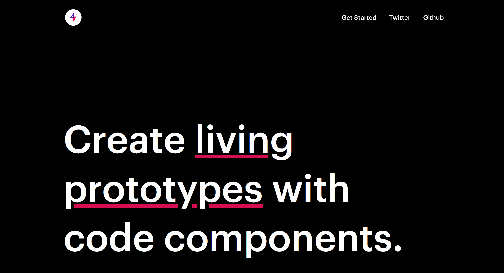

[.build-lists: true]
[.autoscale: true]

# [fit] Some project
## [fit] **on Github**
# [fit] from S2

---

### SinnerSchrader Website

^ Our widely known website

---

### Account Tool

^ Our beloved account tool

---

### SkillWill

^ The infamous SkillWill tool

---

### PushTheButton

^ The game that changed the world

---

### AEM React

^ And of course project related work that is used in our client projects.
^ But there are more. These where just some examples.
^ Like you all know there is also PatternPlate (next slide).

---

### PatternPlate

---

### Alva

^ Both can be found in there own organization, here (next slide)

---

_github.com/patternplate_

_github.com/meetalva_

---
