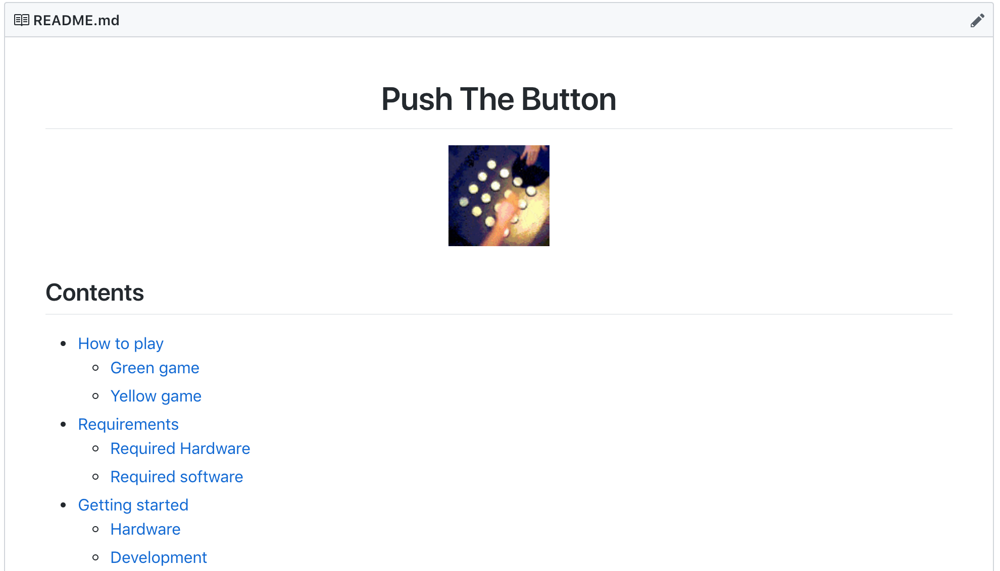

# What **projects**
# can I add to this?

^ @Martin

---

Work related projects?

^ @Martin

---

_Definitely!_

^ @Martin: Some of them where already shown, like the SkillWill tool that was created as a diploma thesis.

---

Are **private projects** okay?

^ @Martin

---

It depends 😅

^ @Martin: Like many times.

---

# PushTheButton

^ Could be one example for private driven project.
^ But the question is ... (next slide)

---

Do you want to share your **private project**?

^ @Martin: And all the time you invested into it?

---

Does it fit into SinnerSchrader?

^ @Martin: And are the basic requirements met? Like Readme, license and co.?

---

I'm not sure!? 🤷‍♀️

^ @Martin

---

## Ask us!

^ @Martin: We can talk about your project and if it fits into the S2 Orga.

---

s2-sg-opensource@sinnerschrader.com

^ @Martin

---
