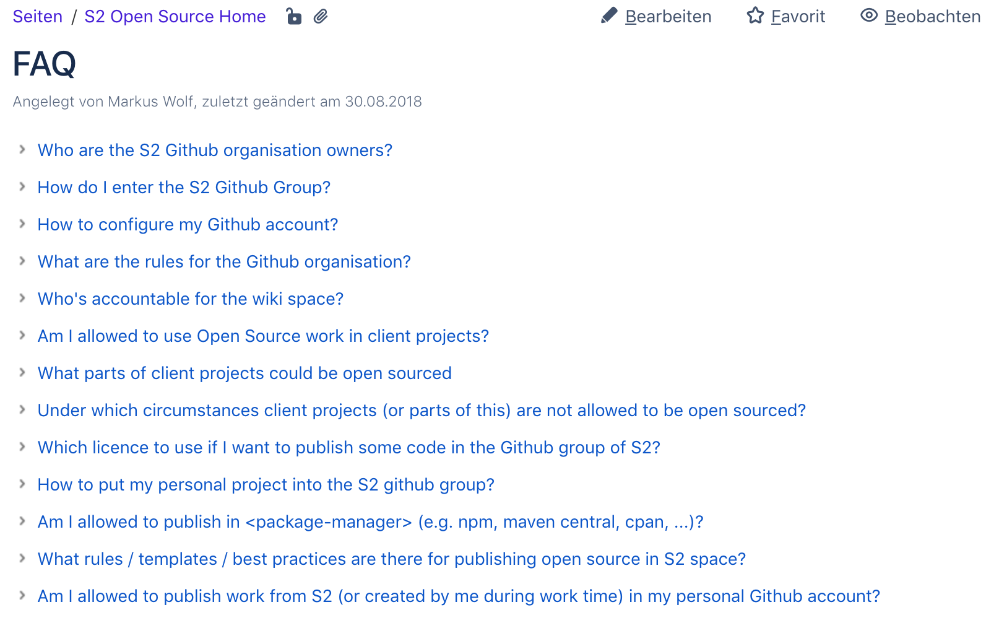

# [fit] How can I
## [fit] **join the S2 Github**
# [fit] Organization?

^ @Martin

---

[.build-lists: true]

## What you need

- You have to feel like 🤓
- And a Github account 🚀

^ @Martin

---

## Whom Do I write?

^ @Martin

---

[.autoscale: true]

### Currently one of them

- Arndt Allmeling
- Daniel Fort
- Peter Ehrenberg
- Holger Blank
- Helge Grimm
- Markus Wolf
- Felicitas Kugland
- Mario Nebl
- Simon Dittlmann
- Gregor Adams
- Ulrich Schumacher

^ @Martin

---

Remember them all? 😨

^ @Martin: Of course not, hehe. But you can find all of them here (next slide).

---

Wiki space for OpenSource, **FAQ Page**

_wiki.sinnerschrader.com/display/S2OSS/FAQ_

^ @Martin: Under the first bullet point: "Who are the S2 Github organization owners?"
^ @Martin: There you can find all of them.

---

More to come ...

^ @Martin: But not only that. You can find other topics as well.
^ @Martin: Like "How to configure my Github account?"

---

## Good question!

^ @Martin: This is actually a good question ...

---

## How do I?

^ @Martin: ... configure my Github account?

---
