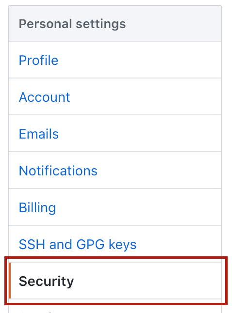
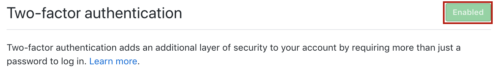
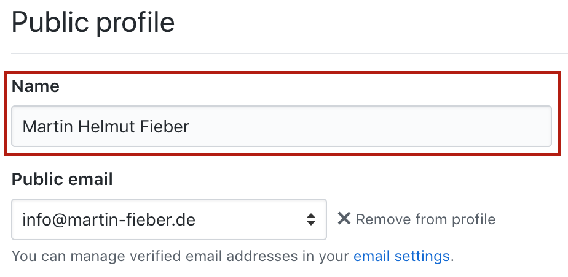
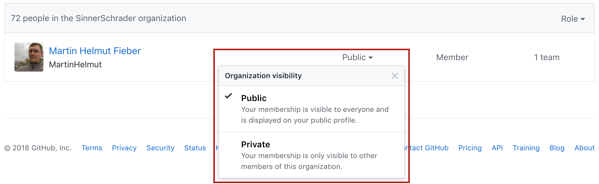

## Some settings to take care of

---

# [fit] 2FA
**(Two-factor authentication)**

---

Go to your settings ...

---

Open the **security tab**

---

Enable 2FA

---

Follow further instructions 😎

^ These will guide you through the process of enabling 2FA.

---

Give yourself a _public name_.

^ But there is more.

---

It would be lovely if this would be your **real name** 😉

^ Or your first name with one letter surname or some like that.

---

Again, open your settings ...

---

And add your name so people know who you are

---

Do you want others to see that you're **part of the SinnerSchrader Organization**?

^ There is also the question if you want others to see that you're part of the SinnerSchrader Organization.

---

Because: **Default is private!**

---

Go to our Organization

_github.com/sinnerschrader_

---

Open the _people_ tab

---

Search for your name

---

And set yourself to **public**

---

**Done** 🎉

^ Now others can see that you're part of the SinnerSchrader Organization

---
